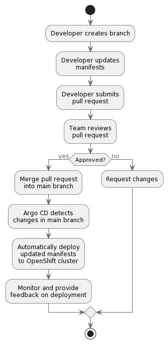
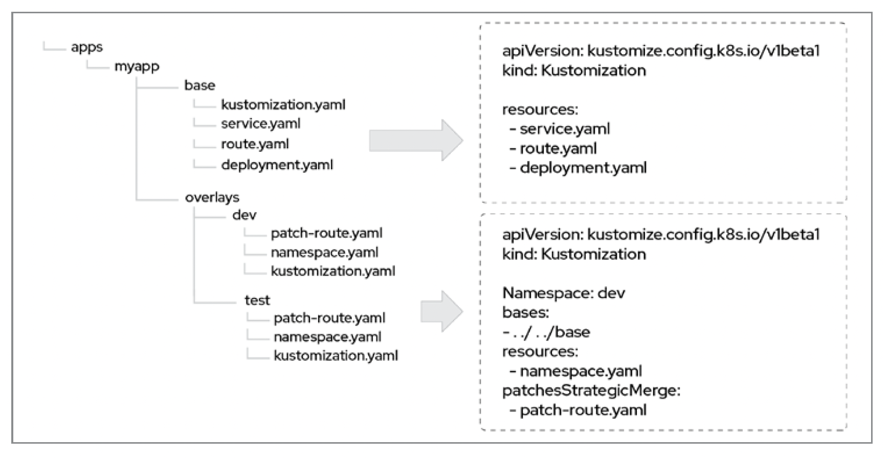
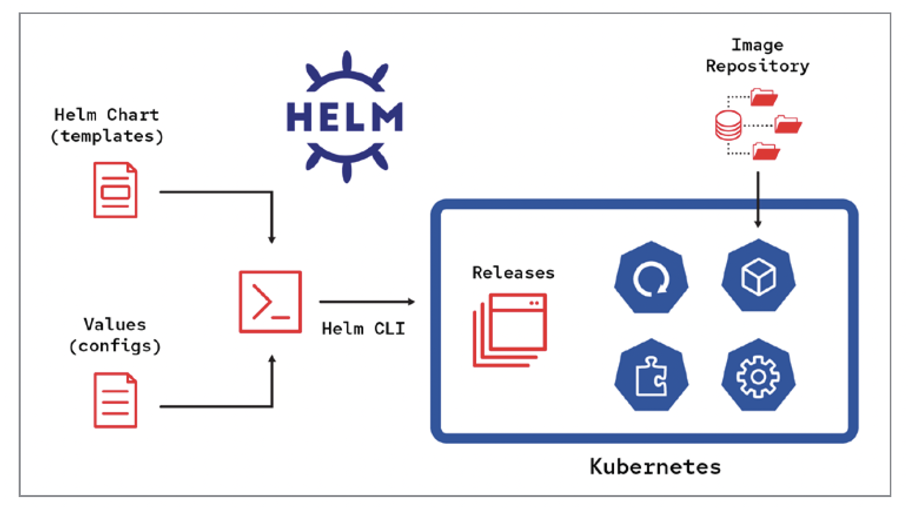
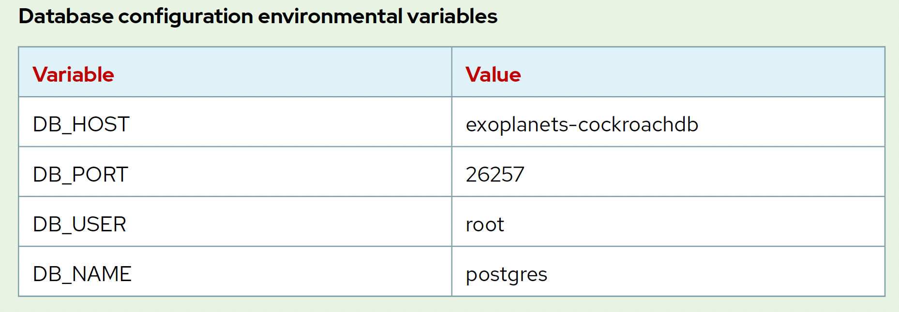
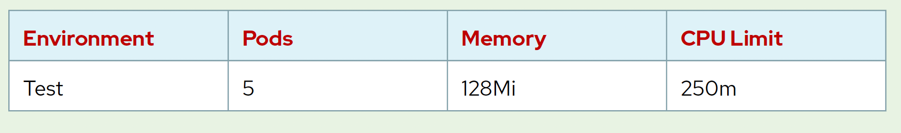
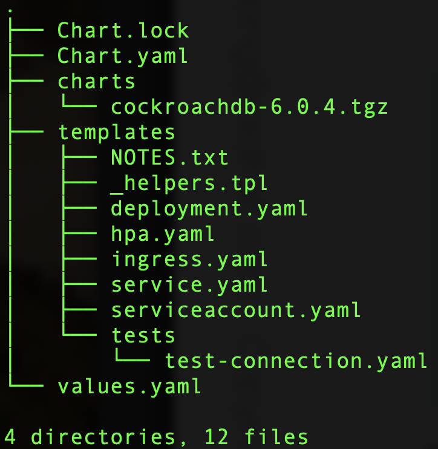
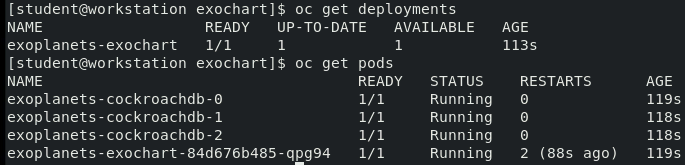

## From DevOps to GitOps

- ```GitOps``` is an operational model that revolves around using ```Git``` as the single source of truth for declarative infrastructure and applications. 

- It emphasizes version control, collaboration, and automated deployment of application code and infrastructure, treating both as code. With GitOps, the desired state of your infrastructure and applications is defined in ```Git``` repositories, and any changes to the desired state are automatically applied to the systems by continuous delivery pipelines.

### In a GitOps workflow:

- Developers and operators define the desired state of the application and infrastructure using declarative configuration files (YAML, JSON, etc.).
These configurations are stored in a Git repository, making Git the single source of truth.
- Any changes to the configuration files are reviewed and merged through Git's standard branching, pull request, and merge workflows.
- Continuous delivery pipelines (e.g., using tools like Argo CD, Tekton, or Jenkins) monitor the Git repository and automatically apply the changes to the appropriate environments (dev, staging, production).
- The pipelines provide feedback on the success or failure of the changes, allowing for rapid detection and resolution of issues.

### Use Case Example

Let's consider a simple example of a GitOps workflow for an OpenShift-based application:

- You store the OpenShift manifests (e.g., DeploymentConfig, Service, ConfigMap, etc.) in a ```Git``` repository.
- When a developer wants to update the application or its configuration, they create a branch, make the changes, and submit a ```Pull Request```
- The ```Pull Request``` is reviewed by team members, and if approved, it is merged into the main branch.
- A GitOps tool like ```Argo CD``` detects the changes in the main branch and automatically deploys the updated manifests to the OpenShift cluster.
- If any issues arise during the deployment, the tool provides feedback, allowing for quick detection and resolution.
- This ```GitOps``` approach enables a clear separation of concerns, enforces best practices, and allows for better collaboration, versioning, and auditing. Additionally, it automates deployment, reducing the risk of human errors and improving the overall reliability of the system.



## GitOps Templating

With new OpenShift deployment model, ```yaml``` manifests are stored inside ```Git```. So the question often becomes, “How do I
declaratively describe my resources in Git without copying and pasting the same YAML everywhere?”

### Kustomize

- ```Kustomize``` is a framework for ```patching``` (selectively altering files), built into OpenShift.
- It is a configuation manager that lets you customize untemplated YAML files without touching the original YAML configuration file.
- It is organized in a hierarchical directory structure of ```bases``` and ```overlays```. 
- A ```base``` is a directory with a ```kustomization.yaml``` file containing a set of resources and associated customizations. A base has no knowledge of an overlay and can be used in multiple overlays.
- An ```overlay``` is a directory with its own ```kustomization.yaml``` file that refers to other Kustomize directories as its bases. 
- An ```overlay``` can draw from multiple bases. It composes all resources from bases and can also add customizations on top of them. You can also
write ```kustomization.yaml``` files that build on one another (for example, a base can refer to another base).
- This figure shows a typical use for Kustomize. A directory structure containing many files is shown on the left, and excerpts from particular ```kustomization.yaml``` files on the right.



- The ```base``` directory on the left contains the ```kustomization.yaml``` file that is the foundation for the others. 
- This file is made up of a ```DeploymentConfig```, a ```Service```, and a ```Route``` (which could be replaced by an Ingress if you’re using an ingress controller). 
- For example, the ```base``` OpenShift deployment artifacts (e.g. DeploymentConfig, Service, etc.) could be generated directly from code base, the environment specific settings (e.g. dev, test, staging, production) for these deployment artifacts are defined using ```overlays```

### Helm

```Helm``` functions as a package manager for OpenShift. If you’ve worked on an OpenShift cluster previously, there is a good chance that you have used Helm at some point for its automation benefits. Helm provides not only a method of packaging an application and parameterizing YAML manifests but also a ```templating engine``` that can deploy your application to different environments.

```Helm``` consists of ```charts```, which are packaged and templatized versions of your YAML manifests. You can inject values into the parameters defined in the templates, and Helm injects these values into the manifests to create a release. A release is the end state representation of the YAML that is deployed to your OpenShift cluster. The information is stored as a secret on the cluster.




## Using Helm Charts and Kustomize to Manage OpenShift Application Deployment

In this lab, Part I, you will create a ```Helm Chart``` for an application, and deploy it to an OpenShift cluster. In Part II, you will then further configure the deployed application using ```Kustomize```

## NOTE: the code in this lab was tested and validated on OCP 4.10, later versions of OCP (e.g. 4.12) is not tested yet by this lab.

## Outcomes

You should be able to:
- Create a Helm Chart for an application.
- Deploy the application to an OpenShift cluster.
- Use Kustomize to modify the deployment configuration of the application.

## Pre-requisites and Dependencies

To perform this exercise, make sure that you have network access to the following resources from your workstation:
- A running OpenShift cluster.
- Container image repository hosted in ```quay.io/redhattraining/exoplanets:v1.0```
- CockroachDB Helm Chart from repository ```https://charts.cockroachdb.com/```
- ```helm``` CLI installed locally on workstation
- ```oc``` OpenShift CLI installed locally on workstation
- ```tree``` utility to help visualize Helm chart directory structure


## Summary of Lab Exercise

Lab Sample Application User Story:
- The ```Exoplanets``` application is a web application that shows some information about extra solar planets. 
- This application needs a ```PostgreSQL``` compatible database, such as ```CockroachDB``` to store the information and it has a prepackaged container image in ```Quay```
- Create the Helm Chart for the Exoplanets application and deploy it to the OpenShift cluster according to the following requirements:
- Use ```exochart``` as the Helm Chart name.
- Use the application container in ```quay.io/redhattraining/exoplanets:v1.0```
- Use the ```cockroachdb``` Helm Chart with version 6.0.4 from the repository ```https://charts.cockroachdb.com/``` as the database dependency
- Use port ```8080``` for the application.
- Use the following environmental variables to configure the database connection:



- Use ```exoplanets``` as the Helm Chart installation name
- Use ```exokustom``` as the Kustomize directory
- Use ```helm template``` command to create the baseline definition from the Helm Chart
- Use ```test``` as the directory for the Test ```overlay```
- Use the following resource limits for the Test ```overlay```:



## Part I: Helm Chart Lab

- Create the ```exochart``` Helm chart
```shell
helm create exochart
cd exochart
tree .
```



- Edit the ```values.yaml``` file to add the sample application
```yaml
image:
  repository: quay.io/redhattraining/exoplanets
  pullPolicy: IfNotPresent
  tag: "v1.0"
```

- Add database dependency to ```Chart.yaml```
```yaml
dependencies:
- name: cockroachdb
  version: 6.0.4
  repository: https://charts.cockroachdb.com/
```

- Install the database dependencies for the chart
```shell
helm dependency update
```

- Update ```templates/deployment.yaml``` to pass environment variables defined in the ```values.yaml```
```yaml
containers:
  - name: {{ .Chart.Name }}
    ...output omitted...
    imagePullPolicy: {{ .Values.image.pullPolicy }}
    env:
      {{- range .Values.env }}
    - name: "{{ .name }}"
      value: "{{ .value }}"
      {{- end }}
```

- Add the environmental variables to the end of the ```values.yaml```
```yaml
env:
  - name: "DB_HOST"
    value: "exoplanets-cockroachdb"
  - name: "DB_NAME"
    value: "postgres"
  - name: "DB_USER"
    value: "root"
  - name: "DB_PORT"
    value: "26257"
```

- Create a new namespace on OpenShift and install the sample application using Helm Chart
```shell
oc new-project chartdemo
helm install exoplanets .
```

- If everything is installed and deployed successfully, you should see the sample application and database pods spinned up


## Part II: Kustomize Lab

Suppose we have different levels of test validation sandboxes requirements.  Some are used to simulate low CPU, low memory environments, while others are used to simulate high performance and throughput.  

In Part I, we created a baseline OpenShift application deployment model, how can we now design a solution to support various levels of environment testing while keeping those testing constraints separate from the core baseline deployment model?

We will now use ```Kustomize``` to specify patching the baseline deployment using ```overlays``` 

- Extract the sample application ```deployment``` definitions from the Helm Chart to form the ```base``` Kustomize specification
```shell
cd exokustom
helm template exoplanets ../exochart > ./base/deployment.yaml
```

- Reference the newly created ```deployment.yaml``` in the ```base/kustomization.yaml``` file
```yaml
apiVersion: kustomize.config.k8s.io/v1beta1
kind: Kustomization

resources:
- deployment.yaml
```

- In the ```overlays/dev-test/replica_limits.yaml``` file, we are specifying further changes to the ```Deployment``` CRD that pertains to our dev-test environment.  Recall that in Part I, using Helm Chart, the ```values.yaml``` specified our deployment to have ```replicaCount: 1```
```yaml
apiVersion: apps/v1
kind: Deployment
metadata:
  name: exoplanets-exochart
spec:
  replicas: 5
  template:
    spec:
      containers:
        - name: exochart
          resources:
            limits:
              memory: "128Mi"
              cpu: "250m"
```

- Each overlay also requires a ```kustomization.yaml```
```yaml
apiVersion: kustomize.config.k8s.io/v1beta1
kind: Kustomization

bases:
  - ../../base

patches:
  - replica_limits.yaml
```

- Apply the ```dev-test``` overlay to the running instance of the ```exoplanets``` sample application
```shell
oc apply -k overlays/dev-test
```

- Wait for the pods to finish restarting
```shell
oc get pods --watch -n <project-name>
```

- Verify that the Deployment ```resource limits``` are using the values from our ```overlays/dev-test/replica_limits.yaml```
```shell
oc get deployments exoplanets-exochart -o jsonpath='{.spec.template.spec.containers[0].resources.limits}'
```

## Learning Summary

In this lab, we have shown how to use Helm Chart to specify a baseline sample application OpenShift deployment.  We then simulated environmental changes to the baseline deployment using Kustomize to patch the deployment.

In the next lab, we will show how to use OpenShift GitOps to request patching changes using ```Pull Requests``` and Kustomize overlays

## References
- Kustomize Feature List: https://kubernetes.io/docs/tasks/manage-kubernetes-objects/kustomization/#kustomize-feature-list
